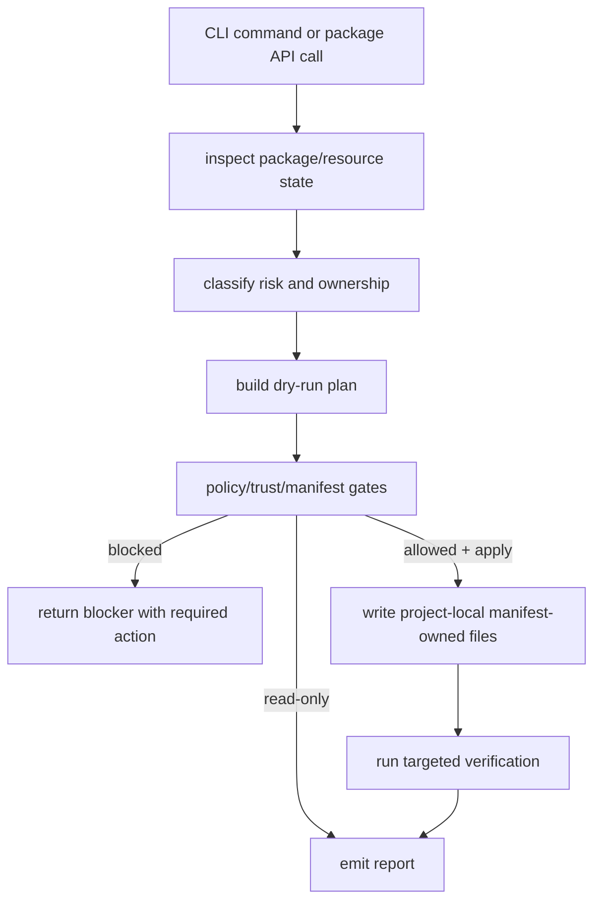

# Olympi

Olympi is a Pi-based harness layer for agentic coding work. It keeps project
state, package resources, policy gates, provenance, hooks, skills, blocker
handling, and verification evidence close to the repository where agents work.

The default operating model is **human-present**: a user is available for
decisions, confirmations, blockers, and review. Autonomous operation is only
valid when a caller/provider explicitly selects it, and it still must pass the
same policy, provenance, blocker, and verification gates.

The current release is a 0-series source checkout. It is not a stable API or a
published package. The implemented contract is the code under `packages/`, the
CLI output, and the specs under `specs/`.

## Install and invocation

Prerequisite: Bun `1.3.14` or newer.

### Source checkout

Use this mode for development and CI in this repository.

```sh
git clone https://github.com/xsyetopz/OpenAgentLayer.git
cd OpenAgentLayer
bun install --frozen-lockfile
bun run olympi -- --help
bun packages/cli/src/cli.ts --help
```

`bun run olympi -- <command>` and `bun packages/cli/src/cli.ts <command>` run
the same CLI entrypoint. `olympi` without a command starts the human-present
interactive harness console.

### Local development link

Use this mode when you want `olympi` on `PATH` while editing this checkout.

```sh
bun link
export PATH="$(bun pm bin -g):$PATH"
olympi --help
```

`bun link` registers the current checkout and exposes the root `bin.olympi`
entry. Re-run `bun link` after changing package metadata.

### Source-global binary

Use this mode when you want a Bun-managed global command backed by this local
checkout.

```sh
bun install -g "$PWD" --production --ignore-scripts
export PATH="$(bun pm bin -g):$PATH"
olympi --help
```

This command is correct for the current private source checkout: the root
`bin.olympi` points at the checked-out Bun/TypeScript entrypoint, and this
release has no required lifecycle scripts. It is not a registry install, and the
binary remains backed by the local checkout. The command is covered by an
install smoke test with an isolated `BUN_INSTALL`.

### Project-local operation

Run Olympi from the project you want to inspect or update:

```sh
cd /path/to/project
olympi setup status
olympi status
olympi package inspect /path/to/pi-package
olympi package evaluate /path/to/pi-package
olympi install /path/to/pi-package --project --dry-run
```

Project apply commands write only project-local `.pi/settings.json` and
manifest-owned `.pi/olympi/**` paths.

### Interactive mode

```sh
olympi
# or
olympi interactive
```

Startup is intentionally short: project path, state path, state summary, and the
public workflow list. Detailed policy/setup information is available through
`safety`, `setup`, and `status`, and mutating flows show decision details at the
confirmation point. Exit the console with `q`, `quit`, or `exit`.

## What it does

- Inspects local Pi packages and inventories skills, prompts, themes,
  extensions, scripts, hooks, tools, providers, and support files.
- Classifies resources as passive or executable before install decisions.
- Mirrors approved passive resources into a project-local, manifest-owned
  `.pi/olympi/**` tree.
- Uninstalls only manifest-owned files whose hashes still match the recorded
  manifest.
- Stages executable package resources only behind signature, lock, sandbox, and
  trust gates before settings load.
- Generates status, handoff, acceptance, package-risk, and debug reports.
- Provides package APIs for bounded goal loops, hook veto decisions, topical
  skill loading, provenance, mutation queues, and verification gates.

## Command surface

Public commands are intentionally small and workflow-shaped:

```sh
olympi                         # human-present console
olympi setup status
olympi status
olympi verify
olympi catalog
olympi package inspect <source>
olympi package evaluate <source>
olympi package risk <source>
olympi install <source> --project --dry-run
olympi install <source> --project --apply
olympi uninstall <package-id> --project --dry-run
olympi report status|handoff|acceptance
olympi safety check
olympi safety hooks policy
olympi safety sandbox check
olympi safety trust status
```

Niche diagnostics and authoring internals live behind `olympi debug ...` or the
specific `safety`/`report` surface. Legacy provider renderer commands are not
part of Olympi.

## Why the architecture exists

Agent tooling has three recurring failure modes:

1. It executes or installs code before trust is established.
2. It loses task state across long runs, compaction, or handoff.
3. It keeps working after a real blocker instead of stopping with a precise
   request for input.

The package model separates these concerns. Inspection and lifecycle state live
outside the CLI. Safety decisions are pure functions. Trust proof is separate
from package evaluation. Reporting reads state and emits artifacts. Authoring
owns first-party resources and workflow contracts. The CLI only dispatches to
public package APIs.

This keeps the system testable and prevents command handling from becoming the
place where policy, state, trust, and reporting logic accumulate.

## Package responsibilities

| Package      | Responsibility                                                                                                                      |
| ------------ | ----------------------------------------------------------------------------------------------------------------------------------- |
| `lifecycle`  | Package inspection, risk evaluation, install/uninstall planning, project manifest/lock/audit state, profile state, goal-loop state. |
| `safety`     | Policy decisions, hook interfaces, sandbox probes, read-only broker validation, quota labels, audit records.                        |
| `trust`      | Executable package trust proof and trust status.                                                                                    |
| `reporting`  | Catalogs, reports, handoffs, compaction, RTK command planning, deterministic serialization.                                         |
| `authoring`  | First-party resource metadata, prompt contracts, review artifacts, module gates, mutation queues, skill registry/refinement.        |
| `extensions` | First-party extension skeletons and Aegis Pi runtime entrypoint.                                                                    |
| `cli`        | Argument parsing and command dispatch. Domain packages must not depend on `cli`.                                                    |

Package boundaries are enforced by convention and tests:

- No `core`, `common`, `shared`, `utils`, or `helpers` package.
- No cross-package internal imports.
- Domain packages export only public APIs from `src/index.ts`.
- Domain packages do not depend on `cli`.
- Mutating behavior is explicit and dry-run first where applicable.

## Execution model



A blocked state is a valid outcome. Examples include missing credentials,
missing files, unclear authority, unavailable commands, failing environment, and
contradictory constraints. The loop must stop and report the blocker instead of
performing unrelated cleanup or hardening.

## Goal loops

The goal-loop API in `lifecycle` models long-running work as explicit state:

- durable objective;
- planned steps;
- progress ledger;
- bounded retry policy;
- blocker detector;
- pause/escalation state;
- completion verification gate;
- continuation recovery after compaction.

Completion is only allowed when the caller supplies objective-specific evidence,
passing verification command records, and an explicit completion audit flag. An informal summary is not completion evidence.

Continuation recovery rebuilds a compact prompt from durable state. It preserves
the objective and completion audit requirements after compaction instead of
relying on a lossy summary.

## Hooks

The hook interface in `safety` models guardrails as typed pipeline phases:

- `pre-action`
- `post-action`
- `pre-commit`
- `post-commit`
- `stop`
- `validation`
- `architecture-boundary`
- `blocked-state`

A hook returns `allow`, `warn`, or `veto`. A veto stops the pipeline and returns
a required next action. The first implemented hooks wrap Themis policy checks,
validation gates, package-boundary checks, and blocked-state pauses.

Provider-loaded hook deployment is still limited. The current Aegis extension is
first-party and explicit; third-party executable packages remain blocked until
trust and sandbox gates pass.

## Skills and refinement

The skill registry in `authoring` separates metadata from loaded content.
Selection uses topical metadata and trigger terms. Skill bodies are loaded only
for selected skills.

The refinement flow is deliberately bounded:

1. A worker attempts a scoped task.
2. A reviewer audits the result.
3. Repeated, generalizable failures become a refinement proposal.
4. The refined guidance is tested on a small subset.
5. Work scales only after validation.

One-off fixes tied to a single file, line, or task are not promoted into general
skills.

## Install workflow

Preview first:

```sh
bun run olympi -- install /path/to/pi-package --project --dry-run
```

Apply after reviewing the plan:

```sh
bun run olympi -- install /path/to/pi-package --project --apply
```

Applied install writes only:

```text
.pi/settings.json
.pi/olympi/olympi.lock
.pi/olympi/olympi-manifest.json
.pi/olympi/audit.jsonl
.pi/olympi/packages/<package-id>/package/**
```

Uninstall uses the manifest as authority:

```sh
bun run olympi -- uninstall <package-id> --project --dry-run
bun run olympi -- uninstall <package-id> --project --apply
```

Changed files are preserved when their current hash differs from the manifest.

## Common commands

```sh
bun install --frozen-lockfile
bun run olympi -- --help
bun run olympi -- package inspect <local-package-path>
bun run olympi -- package evaluate <local-package-path>
bun run olympi -- status --json
bun run olympi -- verify --json
bun run olympi -- interactive
```

## Verification

Required local gates:

```sh
bun install --frozen-lockfile
bun run typecheck
bun run olympi:test
bun run biome:check
bun run olympi:verify -- --json
bun run olympi:catalog -- --json
```

CI runs the same gates and adds `bun run olympi:smoke`, which checks source
invocation, documented help, local `bun link`, and the documented source-global
install command with temporary `HOME`/`BUN_INSTALL` state.

Verification uses temporary projects and fake homes. It checks package
inspection, passive install, manifest-backed uninstall, hash mismatch handling,
project-local writes, no default writes to `~/.pi`, and catalog validity.

## Non-goals for 0.1.0

- User-global Pi package installation or default writes to `~/.pi`.
- Executing untrusted third-party extensions, hooks, tools, providers, package
  scripts, or lifecycle scripts.
- Claims of OS sandbox containment for executable packages.
- Release archives, registry publishing, or package-manager distribution.
- Unbounded multi-agent fan-out.
- Completion without explicit verification evidence.

## Documentation

- [`docs/architecture.md`](docs/architecture.md)
- [`docs/execution-lifecycle.md`](docs/execution-lifecycle.md)
- [`docs/hooks.md`](docs/hooks.md)
- [`docs/skills.md`](docs/skills.md)
- [`docs/package-boundaries.md`](docs/package-boundaries.md)
- [`docs/verification.md`](docs/verification.md)
- [`specs/`](specs/README.md)
