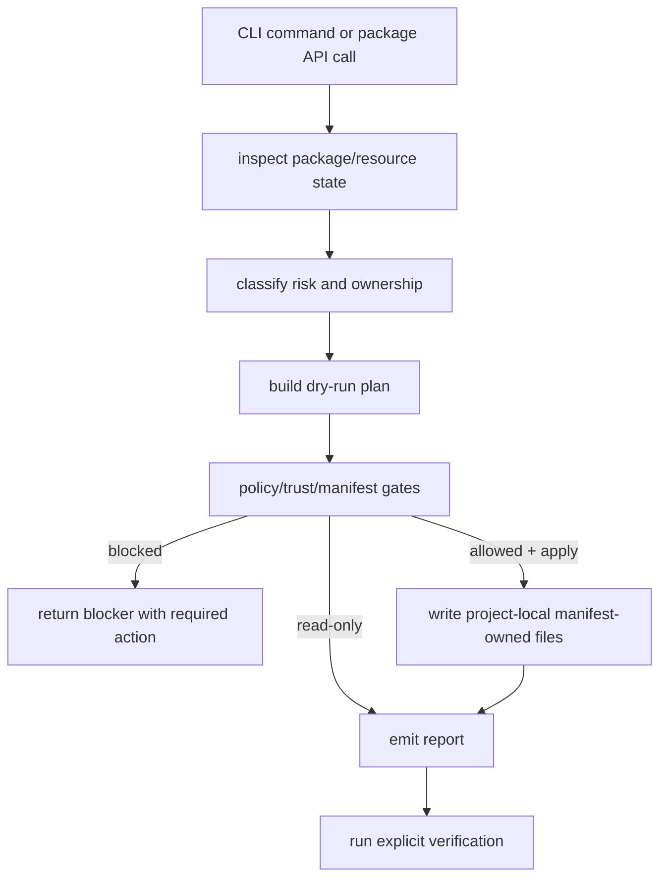

# Olympi

Olympi is a first-party Pi extension and harness layer. Pi is the host/runtime
environment; Olympi wraps Pi workflows with goal state, planning, execution
governance, hooks, skills, code intelligence, provenance, blockers,
verification, and reporting. Pi invokes Olympi as an extension. The `olympi`
CLI is a bootstrap/admin entrypoint for install, uninstall, doctor, status,
reports, project-local memory, and scoped developer verification; it is not a standalone replacement
for Pi.

## Runtime model

- Primary: Olympi runs within Pi as a first-party extension/harness layer.
- Invocation: Pi loads Olympi from the default project-local extension
  entrypoint, explicit global Pi registration, or an explicit `pi -e` path.
- CLI: `olympi` is a bootstrap/admin entrypoint for install, uninstall,
  doctor, status, reports, trust gates, and scoped developer commands.
- State: project-local Pi/Olympi state lives under `.pi/olympi/**` with
  controlled project `.pi/settings.json` entries; the explicit Aegis runtime
  entrypoint lives at `.pi/extensions/olympi-aegis.ts`.
- Writes: project-local state changes require explicit mutating commands such as
  `--save`, `--apply`, or `--write`.
- Global state: global `~/.pi` writes happen only with explicit `--global`,
  confirmation, and provenance gates.
- Outside the product surface: treating Olympi as a standalone replacement for
  Pi, installing Olympi into global Pi state by default, conflating
  package-manager global CLI install with Pi extension registration, or
  writing undeclared provider-home state.

## Installation and invocation decision

Project-local Pi registration is the default. Global Pi registration is
supported only when the user explicitly passes `--global` and the stricter
confirmation/provenance gates. Pi owns `~/.pi/agent/**` user settings, sessions,
auth, global extensions, and package caches; Olympi writes global Pi extension
state only through `olympi install --global --apply --confirm-global
--provenance explicit-user-approval`. Olympi owns project-local `.pi/olympi/**`,
its manifest-owned project `.pi/settings.json` entries, and
`.pi/extensions/olympi-aegis.ts` by default project install.

The intended path is:

```sh
cd /path/to/project
olympi install --dry-run
olympi install --apply
pi
```

Pi then auto-discovers `.pi/extensions/olympi-aegis.ts`; use `/reload` in an
existing Pi session. For a one-off test without writing extension state, run:

```sh
pi -e /path/to/OpenAgentLayer/packages/extensions/src/aegis/pi-runtime.ts
```

`bun link` and `bun install -g "$PWD" --production --ignore-scripts` expose a
package-manager global `olympi` binary for development/admin automation only.
They do not register Olympi in global Pi state. That is a separate explicit
operation:

```sh
olympi install --global --dry-run
olympi install --global --apply --confirm-global --provenance explicit-user-approval
```

```sh
olympi install --dry-run
olympi install --apply
pi
/olympi-goal fix the failing install smoke and verify it
/olympi-execute run the approved verification command
/olympi-complete record verified completion
olympi status
olympi memory status
```

The default workflow:

1. captures the user's goal;
2. keeps the session human-present;
3. creates no source changes;
4. writes goal state only with explicit `--save`;
5. records stop conditions and verification commands;
6. reconstructs continuation context from saved goal state;
7. executes explicit goal-step commands through policy, hooks, skill loading,
   provenance audit, and blocker transitions;
8. can split independent planned steps into bounded team assignments with
   explicit path ownership and parent integration;
9. marks completion only after verification records and completion audit pass.

Developers and CI can inspect/administer the machinery explicitly through full help and package scripts. These are not the normal user workflow:

```sh
olympi doctor --json
olympi status --json
bun run olympi:verify -- --json
bun run olympi:catalog -- --json
olympi report handoff
```

Default help stays short. Internal command discovery is available for
source-checkout developers with `olympi help all`; the product split is mapped
in [`docs/product-surface.md`](docs/product-surface.md).

Under the hood, Olympi keeps project state, policy gates, provenance, hooks,
skills, blocker handling, and verification evidence close to the repository
where agents work. Those mechanisms are progressively disclosed; they are not
the first-run experience.

The default operating model is **human-present**: a user is available for
decisions, confirmations, blockers, and review. Pi slash-command goal handling does
not launch a provider agent. Executing an autonomous goal step requires explicit
`--autonomous --confirm-autonomous`; workspace mutation also requires either
human `--confirm-mutation` or autonomous confirmation with provenance proof.
`/olympi-resume` reads saved state and rebuilds the continuation prompt; it does
not clear active blockers.

The current release is a 0-series source checkout. It is not a stable API or a
published package. The implemented contract is the code under `packages/`, the
CLI output, and the specs under `specs/`.

## Quick start

Prerequisite: Bun `1.3.14` or newer.

### Source checkout

Use this mode for development and CI in this repository.

```sh
git clone https://github.com/xsyetopz/OpenAgentLayer.git
cd OpenAgentLayer
bun install --frozen-lockfile
bun run olympi -- --help
bun packages/cli/src/cli.ts --help
```

`bun run olympi -- <command>` and `bun packages/cli/src/cli.ts <command>` run
the same CLI entrypoint. `olympi` without a command prints bootstrap/admin
help; Pi is the interactive workflow surface.

### Local development link

Use this mode when you want `olympi` on `PATH` while editing this checkout.

```sh
bun link
export PATH="$(bun pm bin -g):$PATH"
olympi --help
```

`bun link` registers the current checkout and exposes the root `bin.olympi`
entry. Re-run `bun link` after changing package metadata.

### Source-global CLI binary

Use this mode when you want a Bun-managed global CLI command backed by this
local checkout. This is CLI availability, not Pi extension registration.

```sh
bun install -g "$PWD" --production --ignore-scripts
export PATH="$(bun pm bin -g):$PATH"
olympi --help
```

This command is correct for the current private source checkout: the root
`bin.olympi` points at the checked-out Bun/TypeScript entrypoint, and this
release has no required lifecycle scripts. It is not a registry install, it does
not write `~/.pi/agent/**`, and the binary remains backed by the local checkout.
The command is covered by an install smoke test with an isolated `BUN_INSTALL`.

## Normal use

Install into the current Pi project and start Pi:

```sh
olympi install --dry-run
olympi install --apply
pi
```

Then use Pi-native workflow commands:

```sh
/olympi-goal update the README quick start and run the docs checks
/olympi-plan review docs and lifecycle code independently
/olympi-execute run the approved verification command
/olympi-complete record verified completion
```

Check current project state or write a handoff when the work needs to continue:

```sh
olympi status
olympi report handoff
```

## Developer and CI/admin use

Use CLI admin commands when you need to inspect installation state, generate reports,
or run repository verification contracts outside Pi:

```sh
olympi doctor --json
olympi status --json
olympi report status --json
bun run olympi:verify -- --json
bun run olympi:catalog -- --json
```

### Project-local operation

Run Olympi from the project you want to inspect or update:

```sh
cd /path/to/project
olympi install --dry-run
olympi install --apply
olympi status
pi
```

Project apply commands write only project-local `.pi/settings.json`,
manifest-owned `.pi/olympi/**` paths, and the explicit
`.pi/extensions/olympi-aegis.ts` extension entrypoint when requested through the
safety hook install command.

### Interaction surface

```sh
olympi install --apply
pi
/olympi-goal improve the failing workflow and verify it
```

Default `olympi` output is intentionally bootstrap/admin help. Normal workflows
live in Pi slash commands and skills after install (for example
`/olympi-goal`, `/olympi-plan`, and `/skill:olympi-goal-loop`). Detailed health
information is available through `doctor` and `status`; developer/CI checks live
through package scripts and full help.

## What it does

- Inspects local Pi packages and inventories skills, prompts, themes,
  extensions, scripts, hooks, tools, providers, and support files.
- Classifies resources as passive or executable before install decisions.
- Mirrors approved passive resources into a project-local, manifest-owned
  `.pi/olympi/**` tree.
- Uninstalls only manifest-owned files whose hashes still match the recorded
  manifest.
- Stages executable package resources only behind signature, lock, sandbox, and
  trust gates before settings load.
- Generates status, handoff, acceptance, package-risk, and debug reports.
- Provides bounded goal loops, governed command execution, bounded team
  assignment plans, hook veto decisions, topical skill loading, provenance,
  mutation queues, and verification gates.

## Command surface

Public CLI commands are intentionally small and admin-shaped:

```sh
olympi                         # bootstrap/admin help
olympi install --dry-run
olympi install --apply
olympi uninstall --dry-run
olympi doctor
olympi status
olympi doctor
olympi report status|handoff|acceptance
```

Normal workflow entrypoints are Pi slash commands and skill commands:

```text
/olympi-goal
/olympi-plan
/olympi-execute
/olympi-complete
/olympi-resume
/olympi-handoff
/skill:olympi-goal-loop
/skill:olympi-code-intelligence
```

Advanced CI/internal diagnostics are available through package scripts such as
`bun run olympi:verify -- --json` and `bun run olympi:catalog -- --json`. Legacy provider renderer commands are not part of Olympi.

## Why the architecture exists

Agent tooling has three recurring failure modes:

1. It executes or installs code before trust is established.
2. It loses task state across long runs, compaction, or handoff.
3. It keeps working after a real blocker instead of stopping with a precise
   request for input.

The package model separates these concerns. Inspection and lifecycle state live
outside the CLI. Safety decisions are pure functions. Trust proof is separate
from package evaluation. Reporting reads state and emits artifacts. Authoring
owns first-party resources and workflow contracts. The CLI only dispatches to
public package APIs.

This keeps the system testable and prevents command handling from becoming the
place where policy, state, trust, and reporting logic accumulate.

## Package responsibilities

| Package      | Responsibility                                                                                                                      |
| ------------ | ----------------------------------------------------------------------------------------------------------------------------------- |
| `lifecycle`  | Package inspection, risk evaluation, install/uninstall planning, project manifest/lock/audit state, profile state, goal-loop state. |
| `safety`     | Policy decisions, hook interfaces, sandbox probes, read-only broker validation, quota labels, audit records.                        |
| `trust`      | Executable package trust proof and trust status.                                                                                    |
| `reporting`  | Catalogs, reports, handoffs, compaction context, RTK route evidence, deterministic serialization.                                   |
| `authoring`  | First-party resource metadata, prompt contracts, review artifacts, module gates, mutation queues, skill registry/refinement.        |
| `extensions` | First-party extension skeletons and Aegis Pi runtime entrypoint.                                                                    |
| `cli`        | Argument parsing and command dispatch. Domain packages must not depend on `cli`.                                                    |

Package boundaries are enforced by convention and tests:

- No `core`, `common`, `shared`, `utils`, or `helpers` package.
- No cross-package internal imports.
- Domain packages export only public APIs from `src/index.ts`.
- Domain packages do not depend on `cli`.
- Mutating behavior is explicit and dry-run first where applicable.

## Execution model



A blocked state is a valid outcome. Examples include missing credentials,
missing files, unclear authority, unavailable commands, failing environment, and
contradictory constraints. The loop must stop and report the blocker instead of
performing unrelated cleanup or hardening.

## Goal loops

The goal-loop API in `lifecycle` models long-running work as explicit state:

- durable objective;
- planned steps;
- progress ledger;
- bounded retry policy;
- blocker detector;
- pause/escalation state;
- completion verification gate;
- continuation recovery after compaction.

Completion is only allowed when the caller supplies objective-specific evidence,
passing verification command records, and an explicit completion audit flag. An informal summary is not completion evidence.

Continuation recovery rebuilds a compact prompt from durable state. It preserves
the objective and completion audit requirements after compaction instead of
relying on a lossy summary.

## Hooks

The hook interface in `safety` models guardrails as typed pipeline phases:

- `pre-action`
- `post-action`
- `pre-commit`
- `post-commit`
- `stop`
- `validation`
- `architecture-boundary`
- `blocked-state`

A hook returns `allow`, `warn`, or `veto`. A veto stops the pipeline and returns
a required next action. The first implemented hooks wrap Themis policy checks,
validation gates, package-boundary checks, and blocked-state pauses.

Hook execution is first-party only. The Aegis extension is explicit and
project-owned; third-party/provider-loaded hook execution is outside the
product surface.

## Skills and refinement

The skill registry in `authoring` separates metadata from loaded content.
Selection uses topical metadata and trigger terms. Skill bodies are loaded only
for selected skills.

The refinement flow is deliberately bounded:

1. A worker attempts a scoped task.
2. A reviewer audits the result.
3. Repeated, generalizable failures become a refinement proposal.
4. The refined guidance is tested on a small subset.
5. Work scales only after validation.

One-off fixes tied to a single file, line, or task are not promoted into general
skills.

## Package/resource install workflow

This workflow installs Pi package resources into project-local Olympi state. It
does not perform global Pi registration; `olympi install` without a source
registers the Pi extension project-locally by default, and `olympi install
--global` performs explicit global registration.

Preview first:

```sh
bun run olympi -- dev install /path/to/pi-package --project --dry-run
```

Apply after reviewing the plan:

```sh
bun run olympi -- dev install /path/to/pi-package --project --apply
```

Applied package/resource install writes only:

```text
.pi/settings.json
.pi/olympi/olympi.lock
.pi/olympi/olympi-manifest.json
.pi/olympi/audit.jsonl
.pi/olympi/packages/<package-id>/package/**
```

Uninstall uses the manifest as authority:

```sh
bun run olympi -- dev uninstall <package-id> --project --dry-run
bun run olympi -- dev uninstall <package-id> --project --apply
```

Changed files are preserved when their current hash differs from the manifest.

## Common commands

```sh
bun install --frozen-lockfile
bun run olympi -- --help
bun run olympi -- --help
bun run olympi -- install --dry-run
bun run olympi -- status --json
bun run olympi -- doctor --json
bun run olympi:verify -- --json
```

## Verification

Required local gates:

```sh
bun install --frozen-lockfile
bun run typecheck
bun run olympi:test
bun run biome:check
bun run olympi:doctor -- --json
bun run olympi:verify -- --json
bun run olympi:catalog -- --json
```

CI runs the same gates and adds `bun run olympi:smoke`, which checks source
invocation, documented help, local `bun link`, and the documented source-global
CLI install command with temporary `HOME`/`BUN_INSTALL` state.

Verification uses temporary projects and fake homes. It checks package
inspection, passive install, manifest-backed uninstall, hash mismatch handling,
project-local writes, no default writes to `~/.pi`, and catalog validity.

## Product exclusions

- Accidental/global-by-default writes to `~/.pi`.
- Global Pi extension registration without `--global --confirm-global` and
  explicit provenance.
- Executing untrusted third-party extensions, hooks, tools, providers, package
  scripts, lifecycle scripts, or provider-native swarms.
- Provider runtime launch as a user/product capability; provider-event fixtures
  are internal policy/conformance tests only.
- Live executable-resource host brokering as a user/product capability;
  executable package handling is intake classification, hashing, trust signage,
  and policy gating only.
- Release archives, registry publishing, or package-manager distribution.
- Unbounded multi-agent fan-out.
- Completion without explicit verification evidence.

## Documentation

- [`docs/architecture.md`](docs/architecture.md)
- [`docs/execution-lifecycle.md`](docs/execution-lifecycle.md)
- [`docs/hooks.md`](docs/hooks.md)
- [`docs/skills.md`](docs/skills.md)
- [`docs/package-boundaries.md`](docs/package-boundaries.md)
- [`docs/verification.md`](docs/verification.md)
- [`specs/`](specs/README.md)
