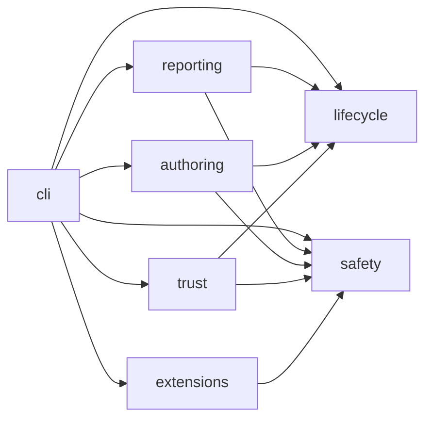
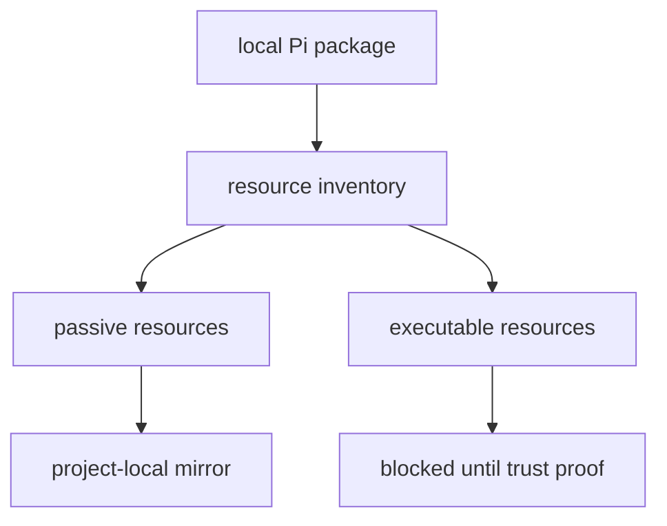

# Architecture

The system is a set of single-word domain packages plus a CLI dispatcher. Domain
packages expose public APIs from `src/index.ts`. The CLI imports those APIs and
contains argument parsing only.



The graph is intentionally small. There is no shared catch-all package. New code
must live in the package that owns the state or decision it changes.

## Domain packages

| Package | Owns | Does not own |
| --- | --- | --- |
| `lifecycle` | Local package inspection, evaluation, install/uninstall plans, manifest/lock/audit state, project status, goal-loop state. | CLI parsing, policy definitions, trust signatures, report formatting. |
| `safety` | Policy decisions, hook interfaces, sandbox probes, broker request validation, quota labels, safety audit records. | Package install state, executable trust proof, CLI output. |
| `trust` | Executable package load proof and trust status. | Package inspection, sandbox implementation, CLI commands. |
| `reporting` | Catalogs, status reports, handoffs, acceptance reports, compaction, RTK command planning. | Mutating project state except explicit artifact writes routed through lifecycle-owned paths. |
| `authoring` | First-party resource metadata, prompt contracts, plan/diff review artifacts, mutation queues, module gates, skill registry. | Package evaluation, runtime safety policy, executable trust decisions. |
| `extensions` | First-party extension skeletons and Aegis runtime entrypoint. | Third-party extension execution or trust decisions. |
| `cli` | Command routing and process I/O. | Domain behavior. |

## State locations

Project-local state is under `.pi/olympi/**`:

```text
.pi/settings.json
.pi/olympi/olympi.lock
.pi/olympi/olympi-manifest.json
.pi/olympi/audit.jsonl
.pi/olympi/packages/<package-id>/package/**
.pi/olympi/reports/**
.pi/olympi/handoff/**
.pi/olympi/profile.json
```

The manifest owns installed files. The lock records trust decisions. The audit
log records explicit operations. Uninstall uses the manifest and hashes; path
names alone are not authority.

## Resource classification



Passive resources are skills, prompts, and static themes. Executable resources
include extensions, hooks, tools, providers, lifecycle scripts, package scripts,
and support scripts. Executable resources are inspected and hashed but not loaded
by default.

## Goal-loop foundation

Goal-loop state belongs to `lifecycle` because it is durable workflow state. It
contains the objective, planned steps, bounded retry policy, ledger entries,
active blocker, verification gate, and continuation recovery state.

The loop is not an autonomous executor. It is a state model used by callers and
future provider integrations. It makes completion and blocker handling explicit.

## Hook foundation

Hook decisions belong to `safety`. A hook pipeline receives a typed context and
returns `allow`, `warn`, or `veto`. Vetoes include a required next action.

Provider deployment is separate from hook semantics. This prevents provider
adapter details from defining the policy model.

## Skill foundation

Skill discovery belongs to `authoring`. The registry indexes skills by metadata
and loads bodies only after topical selection. Refinement proposals are based on
reviewer findings and repeated failure patterns; one-off task fixes are not
promoted into general guidance.
