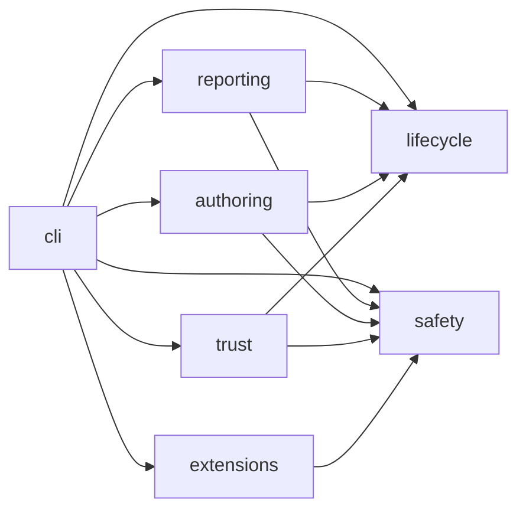
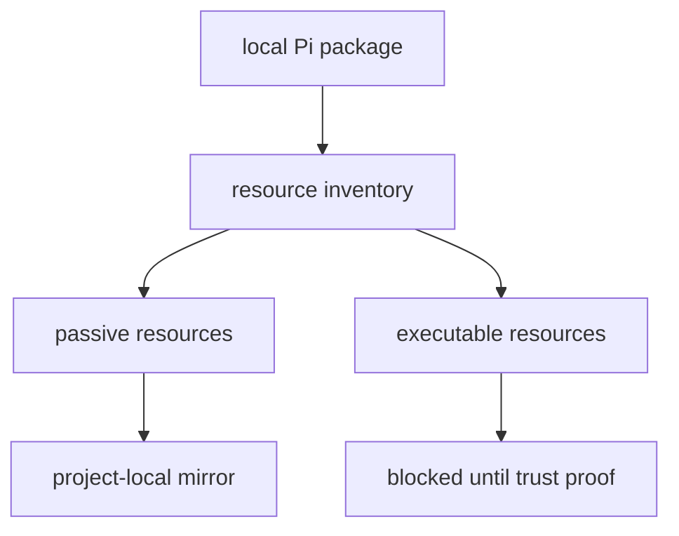

# Architecture

The system is a Pi extension/harness layer plus single-word domain packages. Pi
is the host/runtime environment and invokes Olympi as the default project-local
extension, explicit global registration, or explicit `pi -e` runtime path. The CLI imports the same APIs and provides a
development/admin entrypoint for install, uninstall, doctor, status, verification, and
project-local state; it is not the product runtime identity.

## Primary runtime model

Olympi runs within Pi as a first-party extension/harness. It wraps Pi workflows
with goal state, planning, execution governance, hooks, skills, code
intelligence, provenance, blockers, verification, and reporting.

- Primary runtime: Pi extension/harness invoked by Pi.
- CLI role: development/admin entrypoint into the same Pi/Olympi APIs.
- Project-owned state: `.pi/olympi/**` under the Pi/Olympi project state model.
- Project Pi entries: controlled `.pi/settings.json` updates only through
  explicit install/apply flows, plus `.pi/extensions/olympi-aegis.ts` through
  the default project-local extension install.
- Global state: `~/.pi/agent/extensions/olympi-aegis.ts` may be written only by
  explicit `--global --apply --confirm-global --provenance
  explicit-user-approval`; provider-home writes remain outside the product surface. Package-manager global CLI bins,
  when used, are not Pi extension registration.
- Outside the product surface: standalone replacement for Pi or undeclared global/provider-home
  writes unless implemented and authorized.

Olympi keeps Pi-native extension loading, runtime hooks, RTK routing,
slash-resource registration, and explicit install/uninstall boundaries as
current product architecture.



The graph is intentionally small. There is no shared catch-all package. New code
must live in the package that owns the state or decision it changes.

## Domain packages

| Package      | Owns                                                                                                                        | Does not own                                                                                 |
| ------------ | --------------------------------------------------------------------------------------------------------------------------- | -------------------------------------------------------------------------------------------- |
| `lifecycle`  | Local package inspection, evaluation, install/uninstall plans, manifest/lock/audit state, project status, goal-loop state.  | CLI parsing, policy definitions, trust signatures, report formatting.                        |
| `safety`     | Policy decisions, hook interfaces, RTK proxy routing, anti-bypass guardrails, sandbox probes, broker validation, quota labels, safety audit records. | Package install state, executable trust proof, CLI output.                                   |
| `trust`      | Executable package load proof and trust status.                                                                             | Package inspection, sandbox implementation, CLI commands.                                    |
| `reporting`  | Catalogs, status reports, handoffs, acceptance reports, compaction context, RTK route evidence.                             | Mutating project state except explicit artifact writes routed through lifecycle-owned paths. |
| `authoring`  | First-party resource metadata, prompt contracts, plan/diff review artifacts, mutation queues, module gates, skill registry. | Package evaluation, runtime safety policy, executable trust decisions.                       |
| `extensions` | First-party extension skeletons and Aegis runtime entrypoint.                                                               | Third-party extension execution or trust decisions.                                          |
| `cli`        | Command routing and process I/O.                                                                                            | Domain behavior.                                                                             |

## State locations

Project-local state is under `.pi/olympi/**`:

```text
.pi/settings.json
.pi/olympi/olympi.lock
.pi/olympi/olympi-manifest.json
.pi/olympi/audit.jsonl
.pi/olympi/packages/<package-id>/package/**
.pi/olympi/reports/**
.pi/olympi/handoff/**
.pi/olympi/profile.json
```

The manifest owns installed files. The lock records trust decisions. The audit
log records explicit operations. Uninstall uses the manifest and hashes; path
names alone are not authority.

## Resource classification



Passive resources are skills, prompts, and static themes. Executable resources
include extensions, hooks, tools, providers, lifecycle scripts, package scripts,
and support scripts. Executable resources are inspected and hashed but not loaded
by default.

## Goal-loop foundation

Goal-loop state belongs to `lifecycle` because it is durable workflow state. It
contains the objective, planned steps, bounded retry policy, ledger entries,
active blocker, explicit execution records, verification records, verification
gate, and continuation recovery state.

The loop is not a provider-agent or swarm launcher. The CLI can execute one
explicit saved-step command through policy, hook, skill, provenance, and blocker
paths. It can also record bounded team plans for independent saved steps with
parent-owned integration. Completion and blocker handling are explicit, and
autonomous mode is opt-in rather than inferred from non-interactive use.

## Hook foundation

Hook decisions belong to `safety`. A hook pipeline receives a typed context and
returns `allow`, `warn`, or `veto`. Vetoes include a required next action.

Provider deployment is separate from hook semantics. This prevents provider
adapter details from defining the policy model.

## Skill foundation

Skill discovery belongs to `authoring`. The registry indexes skills by metadata
and loads bodies only after topical selection. Refinement proposals are based on
reviewer findings and repeated failure patterns; one-off task fixes are not
promoted into general guidance.
