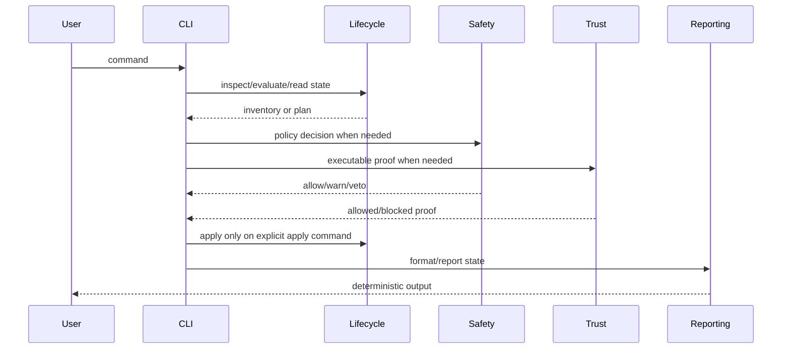

# Execution Lifecycle

The command lifecycle is deliberately conservative.



## Read-only phase

Read-only commands may inspect files, parse metadata, compute hashes, and report
state. They must not run package code or mutate project state.

Examples:

```sh
bun run olympi -- inspect /path/to/package --json
bun run olympi -- package evaluate /path/to/package --json
bun run olympi -- status --json
bun run olympi -- trust status --json
```

## Planning phase

Planning commands produce a write plan without applying it. Plans must list
paths, reasons, warnings, and blockers.

```sh
bun run olympi -- install /path/to/package --project --dry-run
bun run olympi -- uninstall <package-id> --project --dry-run
```

## Apply phase

Apply commands require explicit `--apply`. They write only documented project
paths and append audit records where applicable.

```sh
bun run olympi -- install /path/to/package --project --apply
bun run olympi -- uninstall <package-id> --project --apply
```

## Blocker states

A blocker is a condition that prevents meaningful progress. The loop must pause
when it detects one.

| Blocker | Required behavior |
| --- | --- |
| Missing credentials | Report the missing credential or supported credential-free path. |
| Missing files | Report the path and whether the objective can be revised. |
| Unclear authority | Request approval or ownership clarification. |
| Unavailable command | Report the missing command and fallback, if one exists. |
| Failing environment | Report the failing command/environment condition. |
| Impossible constraints | Report the contradiction and ask for a revised objective. |
| Repeated failures | Stop after bounded attempts and route to review/debug/refinement. |

The correct output is a structured blocked state with attempted work, evidence,
and needed action. Continuing unrelated cleanup is a defect.

## Completion gate

Completion requires all of the following:

- acceptance criteria mapped to evidence;
- required verification commands recorded with exit code `0`;
- explicit completion audit flag;
- no active blocker.

A local subtask finishing is not sufficient. The original objective remains the
completion subject after continuation or compaction.

## Continuation and compaction

Continuation recovery does not depend on a lossy narrative summary. It rebuilds
a prompt from durable state:

- objective;
- completion audit requirements;
- stop/blocker rule.

This prevents the next session from treating a local verification task as the
whole objective.
