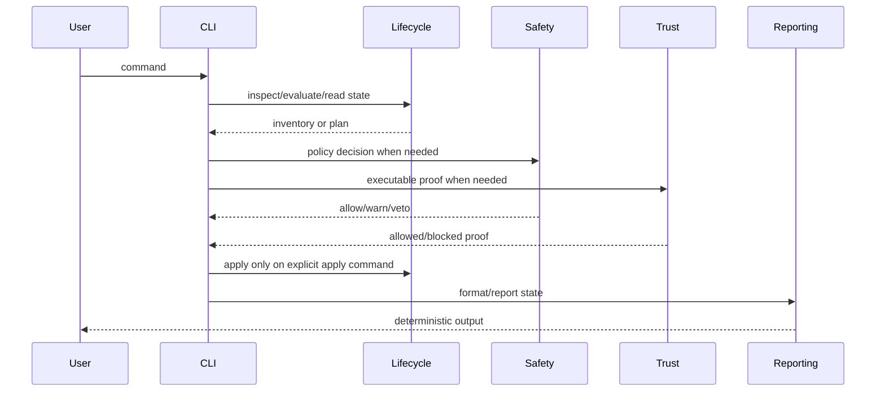

# Execution Lifecycle

The command lifecycle is deliberately conservative.



## Read-only phase

Read-only commands may inspect files, parse metadata, compute hashes, and report
state. They must not run package code or mutate project state.

Examples:

```sh
bun run olympi -- dev package inspect /path/to/package --json
bun run olympi -- dev package evaluate /path/to/package --json
bun run olympi -- status --json
bun run olympi -- safety trust status --json
```

## Planning phase

Planning commands produce a write plan without applying it. Plans must list
paths, reasons, warnings, and blockers.

```sh
bun run olympi -- dev install /path/to/package --project --dry-run
bun run olympi -- dev uninstall <package-id> --project --dry-run
```

## Apply phase

Apply commands require explicit `--apply`. They write only documented project
paths and append audit records where applicable.

```sh
bun run olympi -- dev install /path/to/package --project --apply
bun run olympi -- dev uninstall <package-id> --project --apply
```

## Governed goal execution

Independent saved steps can be split into a bounded team plan before execution
through Pi workflow resources:

```text
/olympi-plan <goal-id> --assign step-1:docs --assign step-2:packages/lifecycle/src
```

Team planning requires two to four assignments, explicit non-overlapping paths,
no active blocker, and a parent integration step. It records orchestration state;
it does not launch provider agents or swarms.

Saved goals can execute one explicit command for one planned step through the
Pi workflow surface:

```text
/olympi-execute <goal-id> --step step-1 --command "bun --version"
```

Execution is not a provider-agent launcher. The command path invokes:

- command normalization and Themis policy decision;
- blocked-state and pre-action hook pipelines;
- topical skill selection and lazy loading;
- bounded worker-result state transition;
- project-local policy and goal audit writes when `--save` is present.

Workspace mutation is blocked unless the user adds `--confirm-mutation` or the
caller explicitly uses `--autonomous --confirm-autonomous` with provenance proof.
Policy and hook vetoes still win after confirmation.

Completion is separate:

```text
/olympi-complete <goal-id> --audit-complete
```

Completion reads saved execution verification records and refuses to mark the
goal complete while required verification commands, blockers, or audit evidence
are missing.

## Blocker states

A blocker is a condition that prevents meaningful progress. The loop must pause
when it detects one.

| Blocker                | Required behavior                                                                                                         |
| ---------------------- | ------------------------------------------------------------------------------------------------------------------------- |
| Missing credentials    | Report the missing credential or supported credential-free path.                                                          |
| Missing files          | Report the path and whether the objective can be revised.                                                                 |
| Unclear authority      | Request approval or ownership clarification.                                                                              |
| Ambiguous ownership    | Stop before restore, delete, move, format, stage, or commit; require manifest/hash/provenance proof or explicit approval. |
| Unavailable command    | Report the missing command and fallback, if one exists.                                                                   |
| Failing environment    | Report the failing command/environment condition.                                                                         |
| Impossible constraints | Report the contradiction and ask for a revised objective.                                                                 |
| Repeated failures      | Stop after bounded attempts and route to review/debug/refinement.                                                         |

The correct output is a structured blocked state with attempted work, evidence,
and needed action. Continuing unrelated cleanup is a defect.

Unexplained workspace changes are user-owned. Path appearance is not ownership:
generated-looking files, `.pi/**` paths, and existing project-local config still
require a manifest hash, provenance record, same-run agent provenance, or
explicit user approval before destructive or revert-like operations.

## Completion gate

Completion requires all of the following:

- acceptance criteria mapped to evidence;
- required verification commands recorded with exit code `0`;
- explicit completion audit flag;
- no active blocker.

A local subtask finishing is not sufficient. The original objective remains the
completion subject after continuation or compaction.

## Continuation and compaction

Continuation recovery does not depend on a lossy narrative summary. It rebuilds
a prompt from durable state:

- objective;
- completion audit requirements;
- stop/blocker rule.

The Pi workflow form is:

```text
/olympi-resume <goal-id> --summary "compacted after inspection"
```

Resume writes only the saved project-local goal file when explicitly saving
state. If the saved goal has an active blocker, resume reports the required
action and returns a blocked state instead of clearing the blocker.

This prevents the next session from treating a local verification task as the
whole objective.
