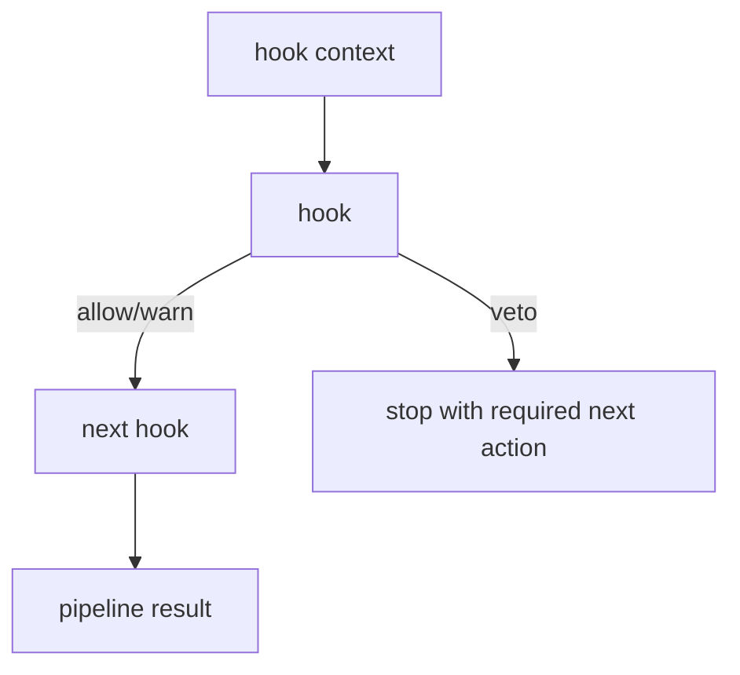

# Hook Lifecycle

Hooks are guardrails around actions and state transitions. The package API is in
`safety`. Provider-specific loading is separate.

## Phases

| Phase | Purpose |
| --- | --- |
| `pre-action` | Veto unsafe commands, protected paths, missing approvals, or executable load attempts before a tool action. |
| `post-action` | Inspect results, redact sensitive output, or record warnings after an action. |
| `pre-commit` | Check staged mutation authority before commit-like operations. |
| `post-commit` | Record post-commit evidence or warnings. |
| `stop` | Check whether a stop is valid, blocked, or premature. |
| `validation` | Require explicit validation evidence before completion. |
| `architecture-boundary` | Veto work outside the approved package or ownership boundary. |
| `blocked-state` | Pause loops with concrete blockers. |

## Decision model

A hook returns:

- `allow` — continue;
- `warn` — continue with recorded reasons;
- `veto` — stop the pipeline and return a required next action.

## Implemented hooks

The current package APIs include:

- Themis pre-action policy hook;
- validation gate hook;
- architecture-boundary hook;
- blocked-state hook.

The Aegis extension provides a first-party Pi runtime entrypoint for live policy
integration. Loading it is explicit. Third-party hook packages are not executed
by default.

## Adding a hook

A new hook must include:

1. typed phase and context fields;
2. deterministic decision output;
3. tests for allow, warn, and veto where applicable;
4. docs/spec updates if the hook changes a product boundary;
5. provider fixture coverage before claiming provider runtime support.
