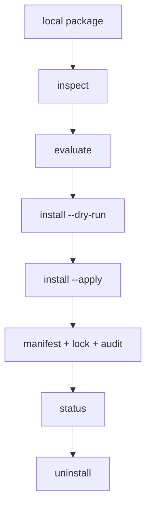

# Package Model

The package model handles local Pi package directories. It does not install
remote dependencies or run package code during inspection, evaluation, planning,
status, catalog, spec, or verification.

## Resource classes

| Class             | Resources                                                                                | Default action                                                        |
| ----------------- | ---------------------------------------------------------------------------------------- | --------------------------------------------------------------------- |
| Passive untrusted | skills, prompts                                                                          | inspect, hash, allow project-local mirror after approval              |
| Passive static    | themes                                                                                   | inspect, parse when useful, allow project-local mirror after approval |
| Executable        | extensions, tools, providers, hooks, lifecycle scripts, package scripts, support scripts | inspect and hash only; block default passive install                  |

## Install path



## Project-local mirror

Applied passive install writes:

```text
.pi/settings.json
.pi/olympi/olympi.lock
.pi/olympi/olympi-manifest.json
.pi/olympi/audit.jsonl
.pi/olympi/packages/<package-id>/package/**
```

The mirror is content-addressed by hashes and referenced from `.pi/settings.json`
as a package source. It is not copied into `.pi/skills` or `.pi/prompts`.

## Uninstall authority

Uninstall reads `.pi/olympi/olympi-manifest.json`. A file is removed only when:

1. the manifest records it;
2. the file still exists;
3. the current hash matches the manifest hash.

Changed or missing files are reported and preserved.
