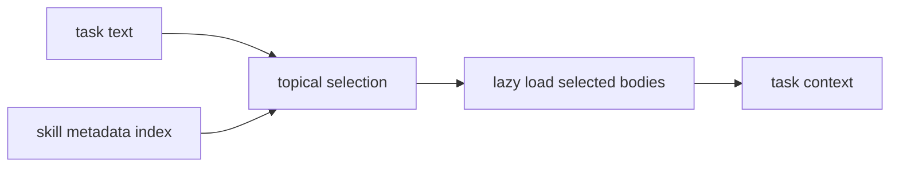
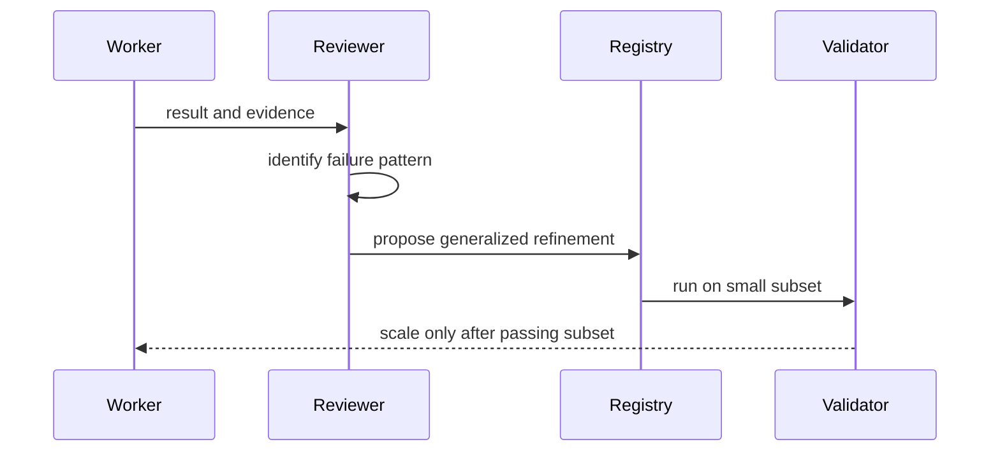

# Skill Loading and Refinement

Skills are topical instructions with metadata. The registry keeps metadata
available for selection and loads body content only when selected.

## Registry model

Each skill has:

- `name`;
- `title`;
- `description`;
- topics;
- trigger terms;
- model tier hint;
- support file paths;
- verification commands.

Selection scores topic and trigger matches against the current task. The caller
then loads only the selected skills.

## Model-tier intent

Model tier metadata is routing guidance, not a provider contract.

- `cheap-worker`: repeatable implementation or search work.
- `standard-worker`: moderate task execution.
- `strong-reviewer`: planning, review, blocker diagnosis, and skill refinement.

The default workflow keeps expensive planning/review separate from repeatable
worker execution.

## Refinement loop

Refinement rules:

- refine only repeated, generalizable failures;
- do not encode one-off file or line fixes;
- keep guidance topical;
- include scripts only when they validate or automate repeated work;
- run a small subset before scaling the updated skill.
