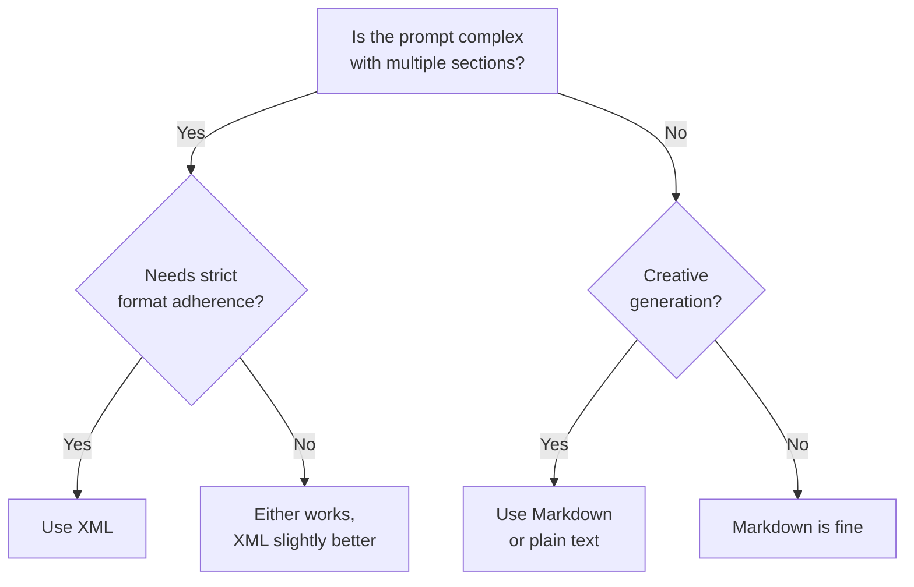

# XML Tagging Best Practices for Claude Prompts

This document provides guidance on when and how to use XML tags in prompts for Claude agents.

## When to Use XML Tags

### Use XML For

| Scenario | Benefit | Example Tags |
|----------|---------|--------------|
| Complex multi-part prompts | Clear section separation | `<role>`, `<instructions>`, `<context>` |
| Hierarchical content | Structured nesting | `<step name="load">`, `<phase>` |
| Strict format adherence | 12% better constraint following | `<output-format>`, `<constraints>` |
| Separating concerns | Prevents instruction/example mixing | `<example>`, `<prohibited>` |
| Long-context prompts (20K+) | Improves document handling | `<document index="1">` |

### Don't Use XML For

| Scenario | Better Alternative |
|----------|-------------------|
| Simple requests | Plain text |
| Creative generation | Markdown or plain text |
| Human readability priority | Markdown |
| Markdown-rendering environments | Markdown with headers |

## Decision Tree



## Best Practices

### DO

1. **Use consistent, descriptive tag names**

   ```xml
   <role>You are the Indexer agent.</role>
   <constraints>...</constraints>
   <prohibited>...</prohibited>
   ```

2. **Nest tags for hierarchy**

   ```xml
   <process>
     <step name="load-context">Read project-index.md</step>
     <step name="analyze">Identify touchpoints</step>
   </process>
   ```

3. **Refer to tag names in instructions**

   ```xml
   <instructions>
   Using the data in <context>, generate a summary.
   </instructions>
   ```

4. **Wrap examples clearly**

   ```xml
   <example type="good">
   fn parse_primary_expr() -> Expr { ... }
   </example>

   <example type="bad">
   fn parse_primary() -> Expr { ... }
   </example>
   ```

5. **Use attributes for metadata**

   ```xml
   <file path=".claude/memory/project-index.md">
   Description of what this file contains
   </file>
   ```

### DON'T

1. **Over-engineer simple prompts**

   ```xml
   <!-- BAD: Too much structure for simple task -->
   <task><action>Fix the typo</action></task>

   <!-- GOOD: Just say it -->
   Fix the typo in README.md line 42.
   ```

2. **Use XML for creative tasks**

   ```xml
   <!-- BAD: Constrains creativity -->
   <poem><style>haiku</style><topic>spring</topic></poem>

   <!-- GOOD: Natural language -->
   Write a haiku about spring.
   ```

3. **Mix inconsistent tag naming**

   ```xml
   <!-- BAD: Inconsistent -->
   <Instructions>...</Instructions>
   <constraints>...</constraints>
   <RULES>...</RULES>

   <!-- GOOD: Consistent lowercase -->
   <instructions>...</instructions>
   <constraints>...</constraints>
   <rules>...</rules>
   ```

## Standard Tag Library

This repository uses a consistent set of XML tags across all agents:

### Structure Tags

| Tag | Purpose | Used In |
|-----|---------|---------|
| `<role>` | Agent identity and purpose | All agents |
| `<triggers>` | When to invoke this agent | All agents |
| `<outputs>` | What files/artifacts produced | All agents |
| `<constraints>` | Limits and rules | All agents |
| `<process>` | Step-by-step workflow | Most agents |
| `<prohibited>` | What NOT to do | All agents |

### Content Tags

| Tag | Purpose | Example |
|-----|---------|---------|
| `<step name="...">` | Named process step | `<step name="load-context">` |
| `<phase name="...">` | Named algorithm phase | `<phase name="structure-discovery">` |
| `<example type="...">` | Code example (good/bad) | `<example type="good">` |
| `<file path="...">` | File reference with path | `<file path=".claude/memory/tasks.md">` |

### Communication Tags

| Tag | Purpose |
|-----|---------|
| `<communication>` | How to message other agents |
| `<starting>` | Message when starting work |
| `<complete>` | Message when done |
| `<blocked>` | Message when stuck |

### Domain-Specific Tags

| Tag | Agent | Purpose |
|-----|-------|---------|
| `<algorithm>` | Indexer | Multi-phase algorithm |
| `<incremental-update>` | Indexer | Update strategy |
| `<guidelines>` | Architect, Scribe | Design/writing guidelines |
| `<code-philosophy>` | Implementer | Coding principles |
| `<test-commands>` | Verifier | Language-specific test commands |
| `<output-formats>` | Scribe | Documentation templates |

## Performance Data

Based on benchmarks from Anthropic:

- **12% better adherence** to constraints with XML vs plain text
- Most effective for **analytical tasks**
- Less difference for **creative generation**
- Significant improvement for **long-context** (20K+ tokens)

## XML in Agent Definitions

All agents in this repository follow a consistent XML structure:

```xml
<role>
You are the {Name} agent. {One-sentence purpose}.
</role>

<triggers>
- Condition 1
- Condition 2
</triggers>

<outputs>
<file path="...">Description</file>
</outputs>

<constraints>
<budget>{N}K tokens maximum</budget>
<rules>
- Rule 1
- Rule 2
</rules>
</constraints>

<process>
<step name="...">...</step>
</process>

<communication>
<complete>Message template</complete>
</communication>

<prohibited>
- Anti-pattern 1
- Anti-pattern 2
</prohibited>
```

## Combining XML with Markdown

XML and Markdown work well together:

```xml
<output-format>

```markdown
# Project Index
**Updated:** {timestamp}

| Module | Files | LOC |
|--------|-------|-----|
| auth | 8 | 1,200 |
```

</output-format>
```

The XML provides structure; Markdown provides formatting for the actual output.

## Sources

- [Anthropic Official Docs: Use XML Tags](https://platform.claude.com/docs/en/docs/build-with-claude/prompt-engineering/use-xml-tags)
- [Why XML Tags Are Fundamental to Claude](https://glthr.com/XML-fundamental-to-Claude)
- [Mastering Claude Prompts: XML vs Markdown](https://algorithmunmasked.com/2025/05/14/mastering-claude-prompts-xml-vs-markdown-formatting-for-optimal-results/)
