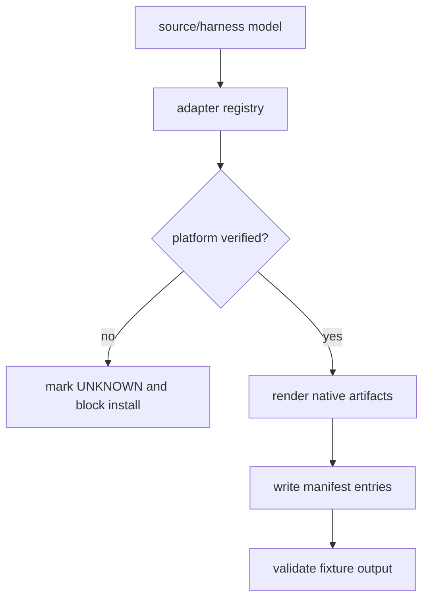
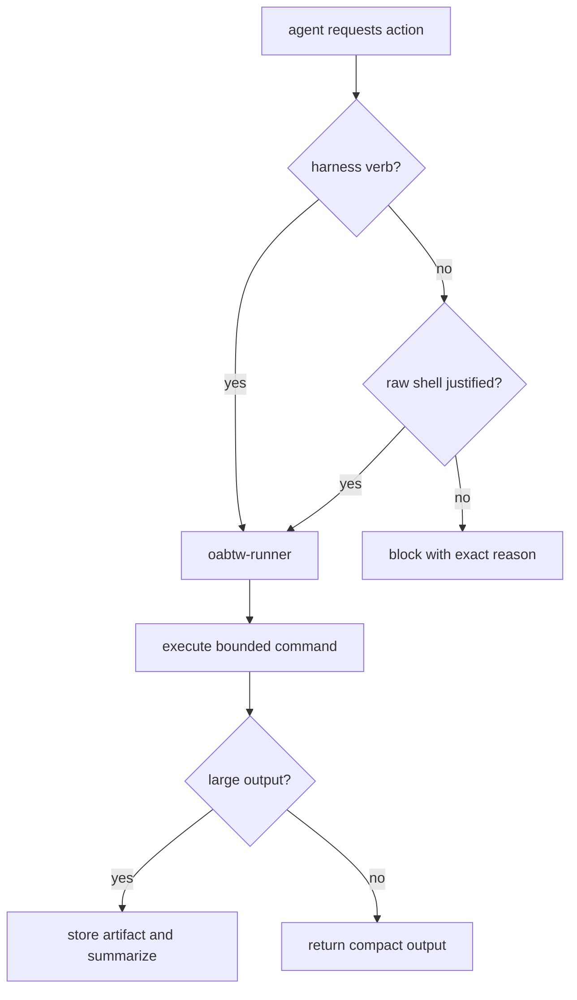
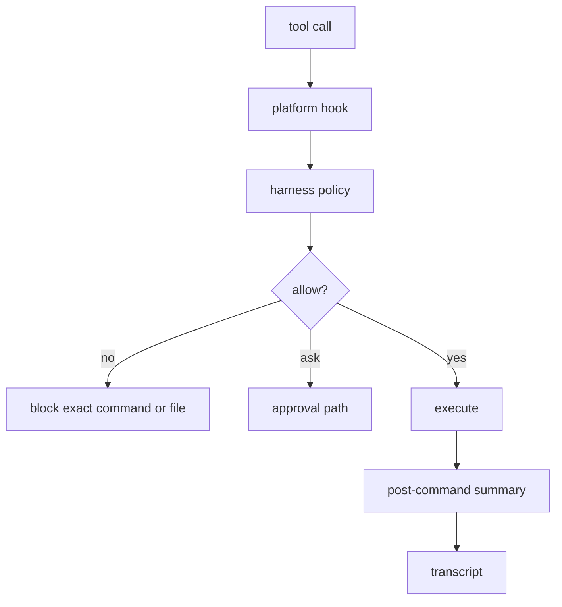
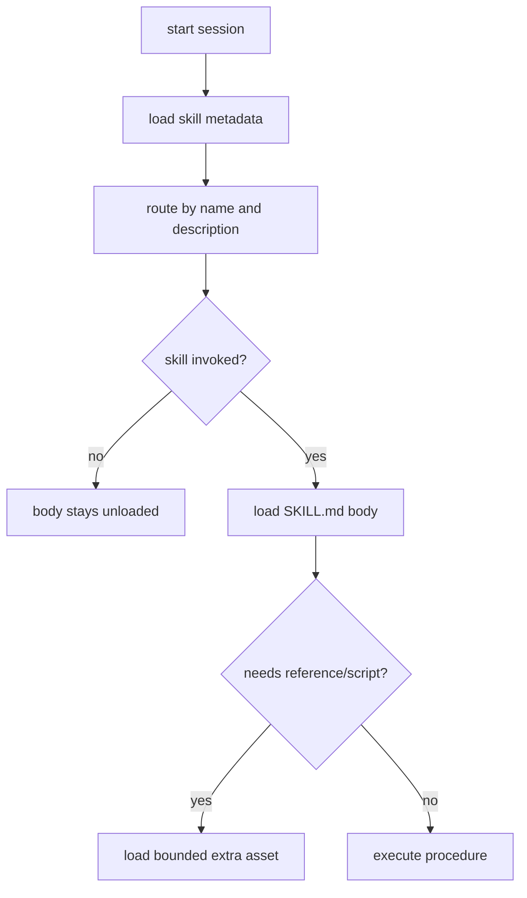
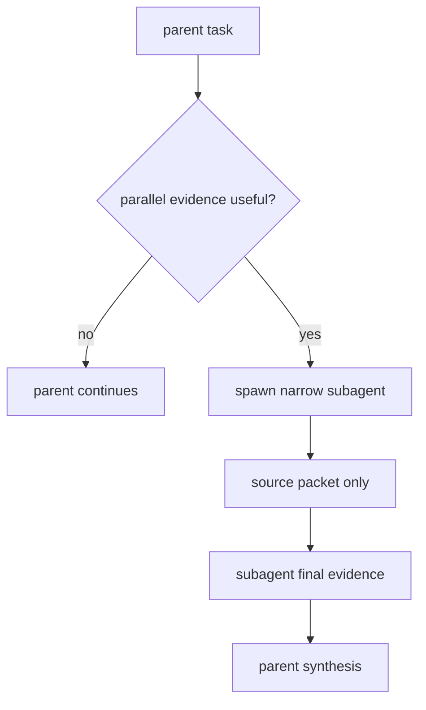
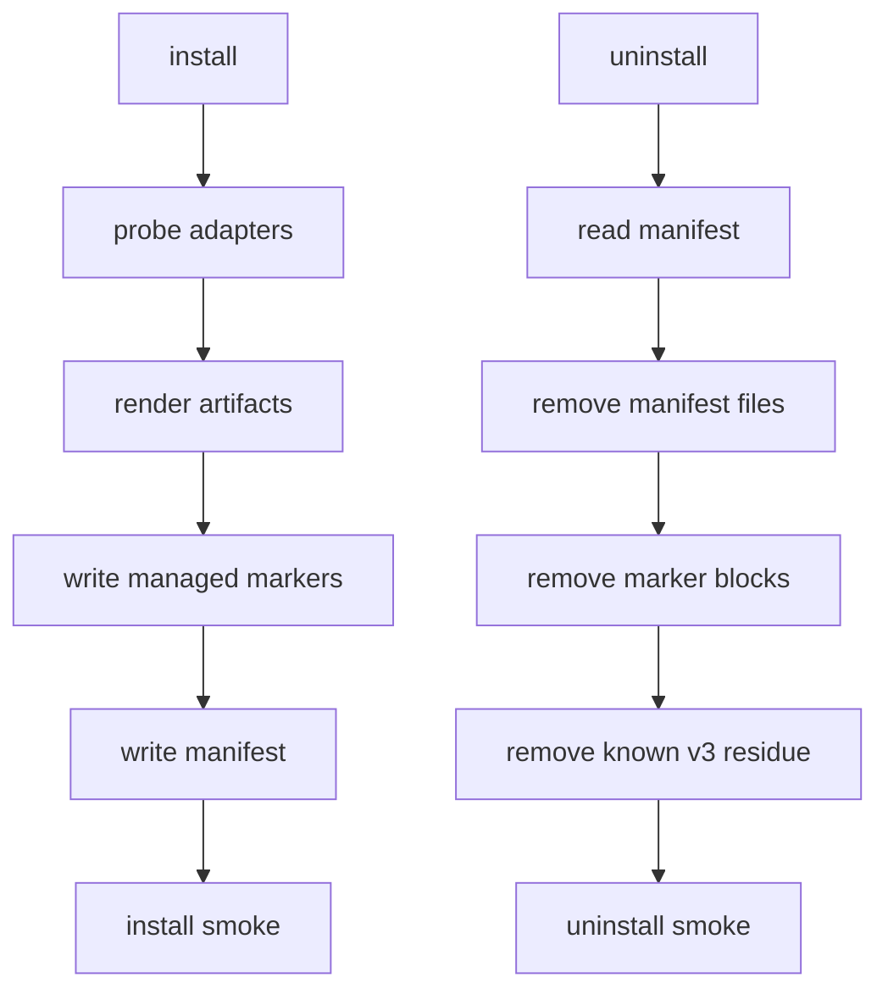
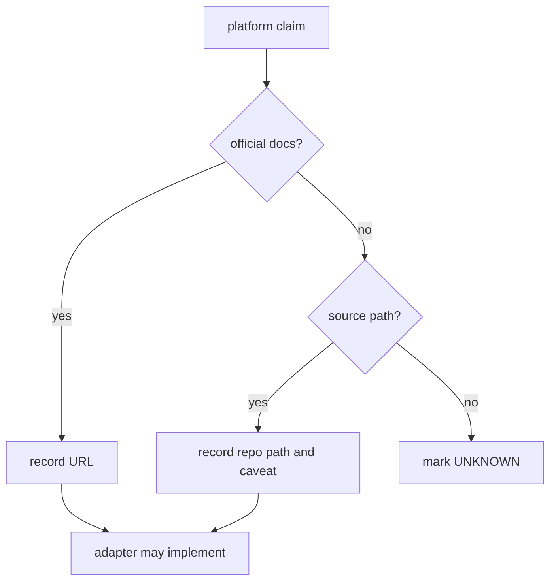

# Mermaid Flows

## Adapter Render Pipeline

## Command Harness Lifecycle

## Hook Execution Flow

## Skill Discovery and Lazy Loading

## Session and Subagent Fanout

## Install and Uninstall Cleanup

## Source Verification Gate

