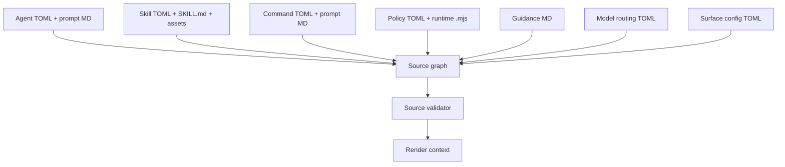
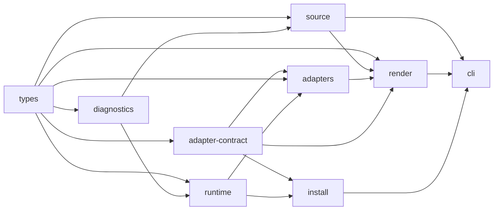
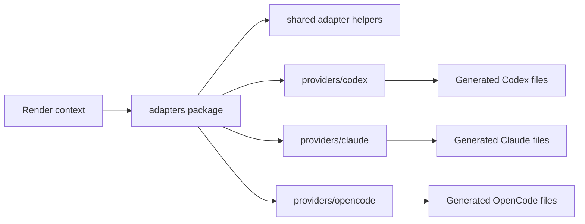
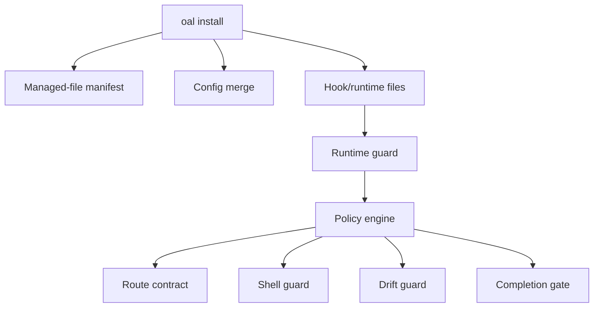

# OpenAgentLayer architecture graph

Purpose: v4 Mermaid graph source.

Authority: normative topology companion to `openagentlayer-v4.md`.

## Source graph

## Package graph

## Adapter graph

Additional adapters require their own surface-config study and allowlist contract before they enter this graph.

## Runtime graph

